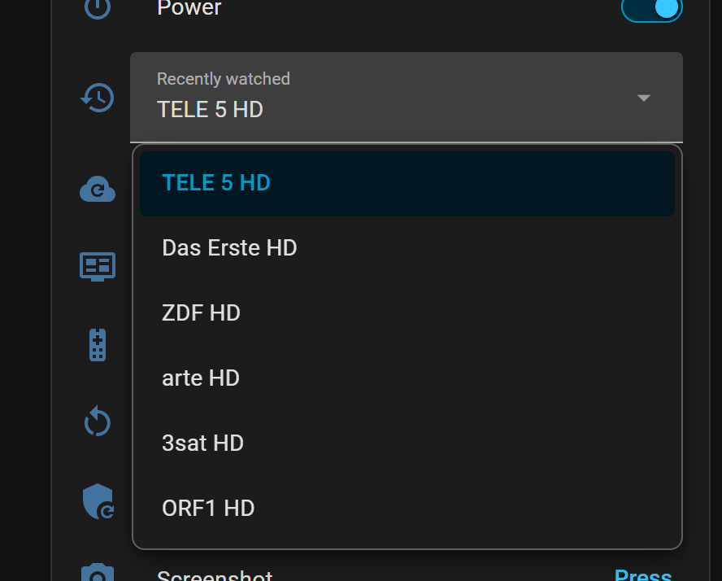

# Enigma2 MQTT Bridge

An Enigma2 plugin for people who run Home Assistant (or anything else that speaks MQTT) and want
their satellite receiver in it without polling OpenWebif.

[](https://github.com/deltasystems-pl/enigma2-mqtt-bridge/actions/workflows/ci.yml)
[](https://github.com/deltasystems-pl/enigma2-mqtt-bridge/releases)
[](LICENSE)


The receiver's device page in Home Assistant, with the companion integration.

## What you get

- The receiver publishes its state the moment it changes: channel, programme, standby, recording,
  volume, remote keys. No fifteen-second polling delay.
- Home Assistant sees the box go offline within about 1.5 times the MQTT keepalive, when the broker
  publishes the box's retained last will.
- Control from Home Assistant: power and standby, zap by channel name or reference, volume and
  mute, remote keys, on-screen messages, recordings, timers and screenshots. Every command is
  checked on the box and a failure is reported on `last_error`.
- Entities appear on their own through Home Assistant's MQTT discovery. For a real media player,
  channel browsing and a guided installer, add the companion integration
  [hass-enigma2-mqtt](https://github.com/deltasystems-pl/hass-enigma2-mqtt).
- The receiver's zap history, a page inside OpenWebif with every setting and command, and an
  optional softcam restart and EPG import (both off until you allow them on the box).
- Pure Python with one vendored library (paho-mqtt). Nothing to compile, and no connection to
  anything but your broker.



The receiver's zap history in Home Assistant, with the companion integration. Picking a channel
zaps back to it.

## Install

1. Change the receiver's root password. The box will hold a broker login, and most images ship a
   well-known password.
2. Create a broker login for the receiver only, not the one Home Assistant uses. On a broker that
   enforces ACLs, [docs/SETUP.md](docs/SETUP.md#broker-access) has one that limits the login to
   the box's own topics. The Mosquitto add-on in Home Assistant accepts an ACL file but does not
   enforce it, so there the dedicated login is all you get.
3. Add the feed and install, over SSH on the receiver:

   ```sh
   echo 'src/gz enigma2-mqtt-bridge https://deltasystems-pl.github.io/enigma2-mqtt-bridge/feed' \
       > /etc/opkg/enigma2-mqtt-bridge.conf
   opkg update && opkg install enigma2-plugin-extensions-mqttbridge
   ```

4. Restart the GUI (the package never does it by itself), then open *Menu -> Plugins -> MQTT
   Bridge* and enter the broker address and login.

With the feed in place, updates show up in the image's own software update screens.

If you use Home Assistant, the [companion integration](https://github.com/deltasystems-pl/hass-enigma2-mqtt)
can install and configure the plugin for you over SSH, and roll the receiver back if anything
fails. Installing a single IPK from the releases page, the manual `scp` route and removing the
plugin are in [docs/INSTALL.md](docs/INSTALL.md).

## Requirements

- An MQTT broker, for example the Mosquitto add-on in Home Assistant.
- An Enigma2 image with Python 3.9 or newer:

| Image | Status |
|---|---|
| OpenViX 6.6 | supported, tested on a Vu+ Uno 4K SE |
| OpenATV 7.4 / 7.5 | supported, needs a community tester |
| OpenPLi 9.x, OpenBH 6.0 | best effort |
| VTi (Python 2.7) | not supported |

A hook the image does not provide costs one feature, not the plugin: the box lists what it can do
in its `capabilities`. The code is tested on Python 3.9, 3.12 and 3.14. If you run OpenATV,
OpenPLi or OpenBH, a test report in an issue helps;
[CONTRIBUTING.md](CONTRIBUTING.md#becoming-an-image-tester) says what to check.

## Compatibility

| Plugin | Integration |
|---|---|
| 0.3.0 (current) | 0.3.0 |
| 0.2.0 | 0.2.0 |
| 0.1.0 | 0.1.0 |

The integration's `update` entity warns when the box runs a plugin older than the one it bundles.

## Privacy and security

The box stores your broker password, and anyone who can publish to its command topics can switch
on screenshots and remote-key reporting. Where the broker enforces ACLs, limit the box's login to
its own topics and check the ACL by effect: Mosquitto drops a denied publish without telling the
sender. The threat model is in
[SECURITY.md](SECURITY.md).

The channel, programme, keys, zap history and screenshots say what your household watches. They
land on the broker and, by default, in Home Assistant's recorder.
[docs/SETUP.md](docs/SETUP.md#privacy) lists what to switch off or exclude. The plugin has no
telemetry, no cloud part and no update check of its own.

## Documentation

- [docs/INSTALL.md](docs/INSTALL.md) - every install route, updating, removing
- [docs/SETUP.md](docs/SETUP.md) - every setting, the OpenWebif page, the provisioning file,
  a media player without the integration
- [docs/TOPICS.md](docs/TOPICS.md) - the MQTT topics and commands, for Node-RED, openHAB or scripts
- [docs/TROUBLESHOOTING.md](docs/TROUBLESHOOTING.md)
- [ROADMAP.md](ROADMAP.md), [CHANGELOG.md](CHANGELOG.md), [decision records](docs/adr/)
- [SECURITY.md](SECURITY.md), [CONTRIBUTING.md](CONTRIBUTING.md) (testers and German
  translation reviewers are welcome)

## License

[GPL-2.0-or-later](LICENSE), because the plugin imports enigma2's modules. The vendored
paho-mqtt is used under its EDL-1.0 option; see [NOTICE](NOTICE).
